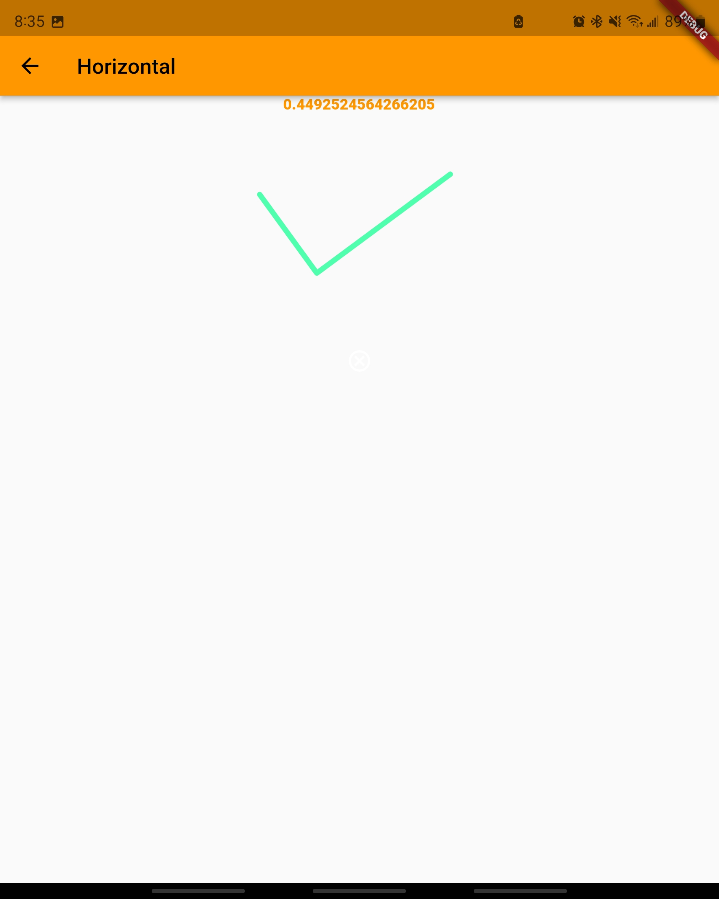
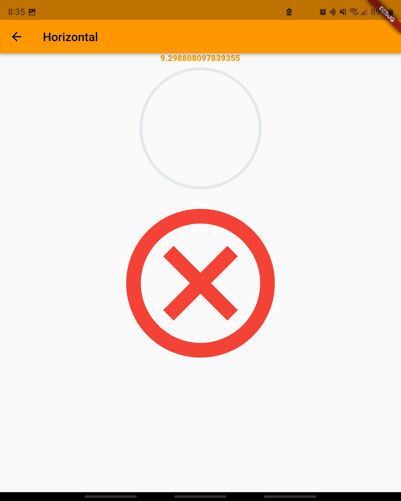
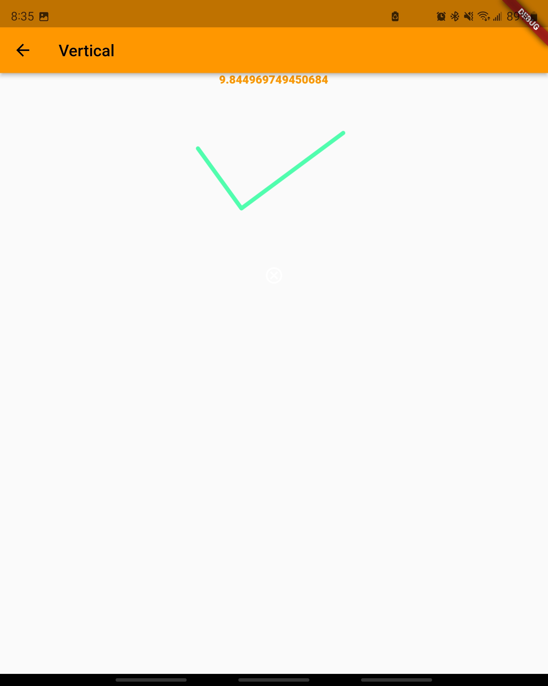
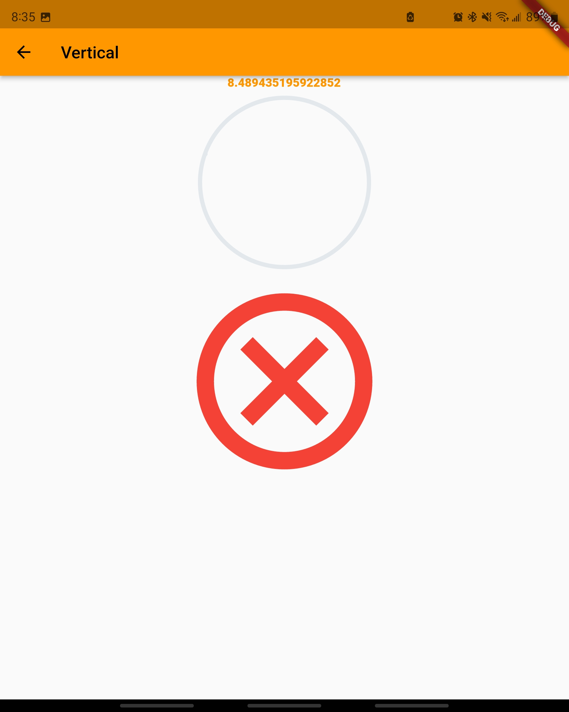

# Leveler App
## Who is the audience for this app

This app is designed for anyone who wants to check how level either a horizontal or vertical surface is on the go!

## What the app does

This app uses the Aeyrium sensor, specifically the pitch and roll variables, to create a margin of error for when the device is horizontal and when the device is vertical. Displaying a green check mark when the device is level and a red X when device is not level.

## Why the app is useful

The app is useful because it allows people to check whether a given surface is level or not without needing a large tool or beam to verify. You only need your mobile phone and you are good to go.

## Screenshots of app

